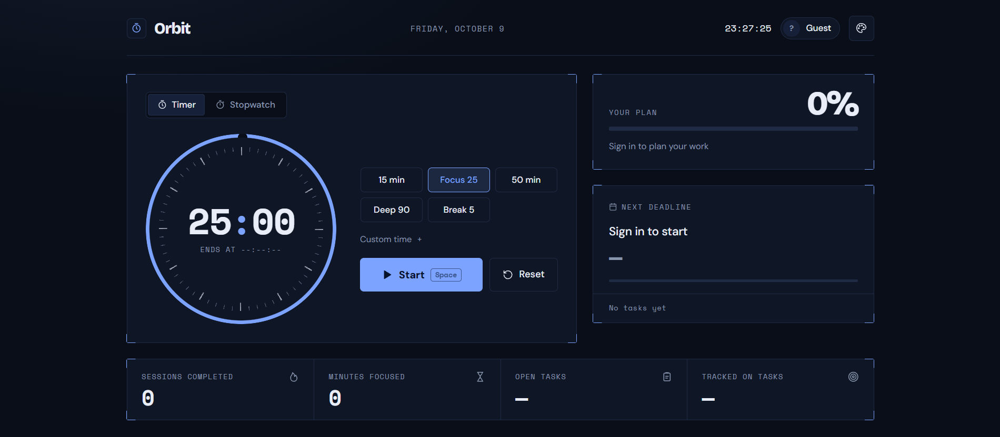


# Orbit

A **study timer + stopwatch + task manager** that runs entirely in the browser: plain HTML, CSS and JavaScript, no build step, no backend.

The idea: pick a task, run the clock, and the time you study is **logged to that task automatically**. Every task has a deadline and a study-time budget, so you can see progress against your plan and get alerted when a deadline slips.

### 🔗 Live demo: **https://deepanshi-code.github.io/Orbit/**

Source code: https://github.com/deepanshi-code/Orbit


---

## Prototype

These images are the real app running with demo data (a timer mid-session, one task being tracked, one overdue and one finished).

### Desktop

| Task board | New task |
|---|---|
|  |  |
| Every task shows its priority, deadline, study time and progress. The task being tracked is highlighted. | Three required steps: what, when, and how much study time it needs. |

### Another theme


Six themes are built in (see [Interface](#interface)); this is **Ivory**.

### Phone

| Clock | Tasks |
|---|---|
|  |  |

On a phone the page switches between **Focus** and **Tasks** from a bottom bar.

### First view (signed out)



---

## Architecture

Everything runs in the browser. `index.html` is the page layout, `style.css` holds the design and themes, and `script.js` contains all the logic.

<p align="center">
  <a href="architecture.png"></a>
</p>

*Click the diagram to open it full size.*

In short:

* **Interface** (page layout, app interactions, themes and views) receives the user's actions and switches the view.
* **Clocks** (countdown timer, stopwatch, clock feedback) record elapsed time in slices. Each slice counts toward today's focus minutes and is added to the task you are focusing on. A finished countdown plays a beep through the Web Audio API.
* **Task planning** (tracking, editing, filters and the plan overview) works on the task list and feeds the daily summary.
* **Profiles and alerts** check task deadlines and send desktop notifications. Profiles hash passwords with WebCrypto and keep profiles, tasks and stats in the browser's `localStorage`.

---

## How to use

1. **Run a clock.** Pick a preset (or set a custom time) and press **Start**, or switch to the stopwatch.
2. **Create a profile** in the Tasks section (needed only for tasks; the clocks work without one).
3. **Add a task** with **New task**: what to do, when it is due, and how many minutes of study it needs.
4. Press **Focus** on a task, then run a clock. The time you study is added to that task and fills its progress bar.
5. Press **Done** when you finish. Anything that passes its deadline is flagged and you are alerted.

---

## Features

### Timer and stopwatch
* Presets (Focus 25, Break 5, Deep 90, ...) plus custom days / hours / minutes / seconds
* Thin ring dial with the time set inside it; the stopwatch sweeps once per minute
* **Accurate in background tabs**: time is computed from timestamps, not by counting `setInterval` ticks
* End-of-session beep (generated with the Web Audio API, no audio file) and a desktop notification
* Only one clock runs at a time, so task time is never double-counted

### Task manager (needs a local profile)
* Each task has a **name**, a **deadline**, an **estimated study time** and a **priority**
* **Plan** tile: overall progress of your planned study time
* **Next deadline** card with a live countdown
* Per-task progress bar that fills as you study the task
* Filters: All / Today / Overdue / Done, with live counts
* Add, edit, complete and delete tasks

### Deadline alerts
* An in-app toast **and** a desktop notification when a deadline passes, plus a heads-up 10 minutes before
* Deadlines missed while the page was closed are reported on your next visit
* Desktop notifications only fire **while the page is open** (a background tab is fine). A static site has no server to push them to a closed browser, and browsers may delay background timers by up to about a minute.

### Today at a glance
* **Sessions completed**: countdown timers that ran all the way to zero
* **Minutes focused**: real running time of the timer *and* the stopwatch
* Open tasks and time tracked on tasks

### Interface
* Quiet, precise design: hairline frames, monospaced numerals, one accent colour per theme
* **Six themes**: Obsidian (default), Ivory, Midnight, Forest, Porcelain, Rosewood. Your choice is remembered.
* Keyboard shortcuts: `Space` start/pause · `R` reset · `N` new task · `1` timer · `2` stopwatch · `T` themes (ignored while you type)
* Responsive: a multi-column dashboard on desktop, a bottom bar on phones
* Respects `prefers-reduced-motion`

---

## About login and your data

There is **no server**. Profiles, tasks and stats are stored in your browser's `localStorage` on this device.

* Usernames are 3 to 20 characters (letters, numbers, `.`, `_`, `-`); passwords need at least 6 characters
* Passwords are never stored, only a **PBKDF2-SHA256 hash with a random salt** (WebCrypto)
* This is a per-browser profile system, **not real authentication**: no password recovery, no sync across devices, and anyone with access to the browser's storage could read or delete the data
* Please don't reuse a password you use elsewhere
* Task text is rendered with `textContent`, so it is never interpreted as HTML

Real accounts and sync would need a backend (for example Firebase or Supabase).

---

## Run it on your own computer

Not needed to use the app (use the live demo above). If you want to run or edit the code locally, there is no build step. Open `index.html` in a browser, or serve the folder:

```bash
python -m http.server 8000
```

Then visit http://localhost:8000. That address only works on your own machine. (WebCrypto and notifications work on `localhost` and `https`.)

To publish your own copy, enable GitHub Pages for the repository (Settings → Pages → deploy from `main`). The site is then served at `https://<your-username>.github.io/<repo-name>/`.

---

## Files

| File | Purpose |
|---|---|
| `index.html` | Page markup |
| `style.css` | Design system and themes |
| `script.js` | Application logic: clocks, tasks, profiles, alerts, themes |
| `architecture.png` | Architecture diagram shown above |
| `screenshot-dashboard.png` | Signed-out first view shown above |
| `prototype/` | Screenshots of the running app (dashboard, task board, new-task dialog, light theme, phone views) |

Fonts (Bricolage Grotesque, DM Sans, Space Mono) load from Google Fonts and fall back to system fonts offline.

---

## Known limitations and ideas

* Tested mainly in Chromium-based browsers; not yet on a real phone or other browsers
* A running timer or stopwatch does not survive a page reload. Study time already logged to tasks is saved (every few seconds, and on pause, finish or close), but the clock itself starts fresh and the task you were focusing on has to be selected again.
* No automated tests yet
* Ideas: weekly study report, Pomodoro auto-cycle (focus, then break), subject tags, backend sync

---

## Author

Deepanshi Agarwal, B.Tech CSE (AI & ML), Graphic Era
